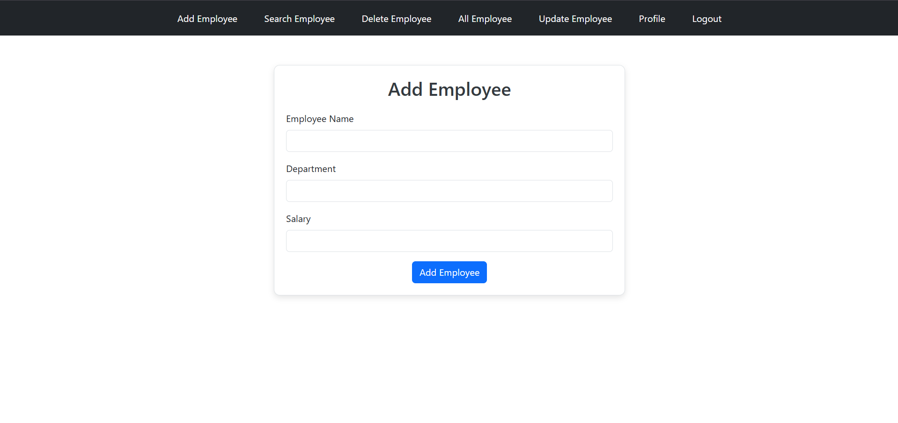

# Employee Management System

The **Employee Management System** is a web application built using **Spring MVC** for the backend, **Hibernate** for ORM, and **JSP** for the frontend. It provides an interface for managing employee records and user accounts with features like login, registration, and CRUD operations.

---

## 📋 Features

### 👤 User Module
- **User Registration**: Allows new users to create an account.
- **User Login**: Enables users to access the application securely.
- **Update Profile**: Users can edit their profile details.

### 🧑‍💼 Employee Module
- **Add Employee**: Users can add new employees.
- **Search Employee**: Allows searching for employees by criteria.
- **Update Employee**: Modify existing employee records.
- **Delete Employee**: Remove employee records from the database.
- **View All Employees**: Displays a list of all employees.

---

## 💻 Tech Stack

- **Backend**: Spring MVC
- **ORM**: Hibernate
- **Frontend**: JSP, Bootstrap
- **Database**: MySQL 
- **Build Tool**: Maven

---

## 🖼️ Screenshots

### Home Page

### User Register Page

### User Login Page

### Welcome Page Page

### Add Employee

### View Employees

### Update Employee

### Delete Employee

### Search Employee

### User Profile

---
Thank you for exploring!  
Happy coding! 🚀
